# SortProfiler
## 📚 Table of Contents
- [SortProfiler](#sortprofiler)
  - [📚 Table of Contents](#-table-of-contents)
  - [💡 Objective](#-objective)
  - [🗺️ Roadmap](#️-roadmap)
    - [🖥️ CLI](#️-cli)
      - [🧭 CLI Navigation Flow Example](#-cli-navigation-flow-example)
    - [🖼️ GUI](#️-gui)
  - [🧠 Notes for Future Me](#-notes-for-future-me)
    - [🎨 GUI Options](#-gui-options)
    - [📜 Logs and Analysis Tool](#-logs-and-analysis-tool)
    - [🗂️ Code Organization Ideas](#️-code-organization-ideas)
    - [🚀 Stretch Goals](#-stretch-goals)
    - [📝 Reminders](#-reminders)

## 💡 Objective
This project (SortProfiler) has two main components to it:

1. Commonly studied sorting algorithms
2. Application performance analysis 

The sorting algorithms serve as a controlled substitute for performance-heavy tasks. They simulate app performance bottlenecks in a predictable and measurable environment. To determine where slowness may come from, the second part of this project aims to build a stack trace with analytics (e.g. time metrics and function hierarchies) attached to it for interpretation. These statistics aim to highlight areas of an app that are underperforming and should be remedied to improve the user experience.

[☝️ Return to top](#sortprofiler)

## 🗺️ Roadmap
At a glance, there are two development stages to SortProfiler:

1. Command Line Interface (CLI): functionality focused
2. GUI: visual and interaction focused

### 🖥️ CLI
This stage is largely focused on the functionality of the project with some level of interactability.

- [X] Implement sorting algorithms
  -  Keep it simple with several algorithms: [1] Bubble sort [2] Insertion sort [3] Merge sort [4] Quick [5] Radix sort [6] Selection sort [7] STL sort().
- [X] Welcome the user to the **main menu**
  - [X] Provide three options: [1] Enter the sorting algorithm benchmark [2] Enter the performance analyzer [E] Exit the program.
- [ ] Sorting algorithm benchmark
  - [ ] Option 1: Run the currently selected sorting algorithm and display (print) time metrics after completion. Return to the benchmark menu (i.e. prompt the user again).
  - [ ] Option 2: Allow the user to change the benchmark's settings. [1] Change the sorting algorithm [2] Change the number of items to sort [3] Turn on/off the creation of performance logs.
  - [ ] Option 3: Return to the main menu.
- [ ] Performance analyzer (ideas laid out below)
  - Choose log file (or display error if none exist)
  - Run chosen log file
    - If log cannot be read, display an error.
  - Display metrics
    - Possibly create graphs for visualization (low priority)

#### 🧭 CLI Navigation Flow Example
This is an example flow that was made to lay out a basic idea of the moving parts. The diagram can and should be formalized and cleaned up in the future (likely with `Draw.io`)

```mermaid
flowchart TB
  S[Program Start]
  S --> |"mainMenu_printMenu()"| MM

  subgraph MM[Main Menu]
      %% direction TB
      MM_1["[1]" Sorting Benchmark]
      MM_2["[2]" Performance Analyzer]
      MM_E["[E]" Exit program]
  end

  MM_1 --> |"benchmark_startProgram()"| SB
  MM_2 --> |"analyzer_startProgram()"| PA
  MM_E --> |"isRunning = FALSE"| E

  subgraph SB[Sorting Benchmark]
    %% direction TB
    SB_1["[1]" Run benchmark]
      SB_1.1["benchmark_runTest()"]
    SB_2["[2]" Configure settings]
    SB_E["[E]" Exit benchmark]

    subgraph SB_BS[Benchmark Settings]
      direction LR
      SB_2.1["[2.1]" Change sorting algorithm]
        SB_2.1.1["benchmark_settingChangeAlgorithm()"]
      SB_2.2["[2.2]" Change number of elements]
        SB_2.2.1["benchmark_settingChangeNumber()"]
      SB_2.3["[2.3]" Toggle log creation]
        SB_2.3.1["benchmark_settingToggleLogs()"]
      SB_2.E["[2.E]" Exit benchmark settings]
        SB_2.E.1["benchmark_startSettings() terminates"]
    end
  end

  SB_1 --> SB_1.1
  SB_2 --> |"benchmark_startSettings()"| SB_BS
    SB_2.1 --> SB_2.1.1
    SB_2.2 --> SB_2.2.1
    SB_2.3 --> SB_2.3.1
    SB_2.E --> SB_2.E.1
  SB_E --> |"benchmark_startProgram() terminates"| MM

  subgraph PA[Performance Analyzer]
    PA_1["[1]" Choose log file]
    PA_2["[2]" Run chosen log file]
    PA_3["[E]" Return to main menu]
  end

  PA_3 --> MM

  E[Program Exit]

  classDef menuOption fill:#222d4d
  class MM_1,MM_2,MM_E,SB_1,SB_2,SB_2.1,SB_2.2,SB_2.3,SB_2.E,SB_E menuOption
```

### 🖼️ GUI
A GUI may be considered after the CLI is complete, primarily as a visual learning extension rather than a core goal.

Potential goals (to expand on later):
- [ ] Create a basic windowed layout with main menu navigation
- [ ] Display benchmarking results using simple charts (bar or line)
- [ ] Allow log file selection and analysis

[☝️ Return to top](#sortprofiler)

## 🧠 Notes for Future Me

### 🎨 GUI Options
While the functionality of the application comes before aesthetics, some considerations are:
  - ImGui for fast prototyping
  - Qt for polished apps.

### 📜 Logs and Analysis Tool
  - Begin with JSON.
  - Consider moving to SQLite if project interest is still there in the future...
  - Show function hierarchy + time metrics.
  - Visualize with charts or tables.

### 🗂️ Code Organization Ideas
- My `.cpp` files are likely to get crowded later. Here are some considerations for future refactoring:
  - `cli_utils.cpp/.h` – menu functions
  - `sorting.cpp/.h` – algorithms
  - `benchmark.cpp/.h` – timers + logs
  - `analyzer.cpp/.h` – log parsing
- [CLI] Each "page" share similar functionalities like printing the menu page... Consider namespaces? For example, `mainMenu::printMenu()` and `benchmark::printMenu()`.
  - Many functions share the same body (i.e. repeated code). Condensing them is a good consideration for the future. See the top comment in `cli_utils.h` for more detail.

### 🚀 Stretch Goals
  - Multi-run stats (avg/worst)
  - Algorithm suggestions based on data
  - Add unit tests for major components

### 📝 Reminders
  - Focus on building first, then clean up once patterns emerge.
  - One small step at a time!

[☝️ Return to top](#sortprofiler)